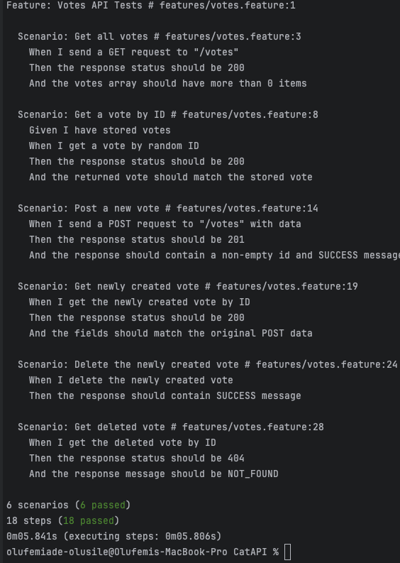

## CatAPI Votes Test

This project uses Cucumber with typescript to test the [Cat API](https://thecatapi.com) `/votes` 
endpoint using a BDD approach.

### Setup

```bash
# 1. Clone the repo or copy files
# 2. Install dependencies
npm install

# 3. Run the test
npx cucumber-js
```

> Make sure your Node version is 14 - 22.

### What It Tests

Each test scenario lives in `features/votes.feature`. 
What we cover:

```
Scenario: Get all votes
When I send a GET request to "/votes"
Then the response status should be 200
And the votes array should have more than 0 items

Scenario: Get a vote by ID
Given I have stored votes
When I get a vote by random ID
Then the response status should be 200
And the returned vote should match the stored vote

Scenario: Post a new vote
When I send a POST request to "/votes" with data
Then the response status should be 201
And the response should contain a non-empty id and SUCCESS message

Scenario: Get newly created vote
When I get the newly created vote by ID
Then the response status should be 200
And the fields should match the original POST data

Scenario: Delete the newly created vote
When I delete the newly created vote
Then the response should contain SUCCESS message

Scenario: Get deleted vote
When I get the deleted vote by ID
Then the response status should be 404
And the response message should be NOT_FOUND
```

### Test Result

